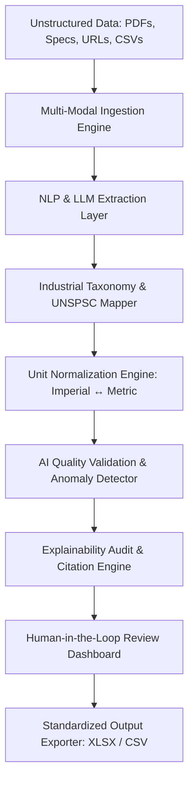

# ProductLens AI — Industrial Product Intelligence Platform
### UniHack 2026 Submission | Powered by Unilog & Hack2skill


---

## Executive Overview

**ProductLens AI** is an enterprise-grade AI Product Intelligence Platform built specifically for industrial commerce challenges. Industrial distributors and manufacturers manage millions of technical SKUs scattered across unstructured PDF technical datasheets, supplier catalogs, spec sheets, and web pages. 

ProductLens AI automatically ingests, enriches, validates, and transforms limited or fragmented product data into commerce-ready, highly accurate product catalogs with transparent audit trails and 1-click export matching exact static headers.

---

## Key Features & Capabilities

### 1. ⚡ Multi-Source Ingestion Engine
- **Flexible Data Processing**: Ingests CSV/XLSX spreadsheets, raw text snippets, unstructured technical PDF specs, and supplier URL feeds.
- **Pre-Loaded Industrial Datasets**: Includes benchmark catalogs for Industrial Valves & Fluid Control, Heavy Pumps & Rotating Equipment, and Electrical Switchgear for instant evaluation.

### 2. 🏷️ Standardized E-Commerce Title Generation
- **Formula-Driven Formatting**: Transforms messy raw strings into compliant e-commerce titles using industrial standards: `[Brand] + [MPN] + [Product Line] + [Primary Specs]`.

### 3. 🌐 UNSPSC Taxonomy & Auto-Classification
- **Vector-Guided Categorization**: Automatically maps products to official global UNSPSC commodity codes (e.g. `40141602` for Solenoid Valves, `40151503` for Centrifugal Pumps, `39121601` for Circuit Breakers).

### 4. 📐 Physics Unit Normalization Engine
- **Multi-System Conversion**: Detects and standardizes imperial measurements into SI metric equivalents (e.g., `150 PSI` $\rightarrow$ `10.34 Bar`, `180°F` $\rightarrow$ `82.2°C`, `1/2 inch` $\rightarrow$ `12.7 mm`).

### 5. 🔍 Explainable AI (XAI) Audit & Human-in-the-Loop Studio
- **Field-Level Confidence Scores**: Assigns precision confidence ratings (0-100%) for every extracted attribute.
- **Source Citation Traceability**: Links extracted specs back to source datasheet page numbers and URL snippets.
- **Interactive Review Modal**: Allows catalog managers to inspect LLM reasoning chains, edit fields inline, and re-validate records instantaneously.

### 6. 📊 Static Output Exporter (.xlsx / .csv)
- **Strict Schema Adherence**: Exports clean spreadsheets matching the exact **15 static expected output headers** required by the Unilog hackathon evaluation suite.

---

## Technical Architecture



---

## Output Header Specifications (Static Expected Output)

ProductLens AI populates the following 15 static headers without altering names, types, or order:

| Header Name | Description | Example Output |
| :--- | :--- | :--- |
| `Product_ID` | Unique SKU identifier | `SKU-V-101` |
| `MPN` | Manufacturer Part Number | `SV-24V-05` |
| `Brand_Name` | Verified Manufacturer Brand | `FlowTech` |
| `Product_Title` | Cleaned, Standardized Title | `FlowTech [SV-24V-05] 1/2" NPT Solenoid Valve (Brass, 24VDC, 150 PSI)` |
| `Short_Description` | Concise e-commerce summary | `High-efficiency industrial solenoid valve for severe-duty applications.` |
| `Long_Description` | Formatted HTML description | `<div class="product-description">...</div>` |
| `Category_Path` | Taxonomy breadcrumb path | `Industrial Valves & Fluid Control > Solenoid Valves` |
| `UNSPSC_Code` | Standard commodity code | `40141602` |
| `Primary_Specifications` | Key-value spec string | `Material: Brass \| Voltage: 24VDC \| Pressure: 150 PSI` |
| `Enriched_Attributes` | Structured JSON string | `{"Material": "Brass", "Voltage": "24VDC", "Pressure": "150 PSI"}` |
| `Validation_Status` | Health indicator | `VALID` \| `WARNING` \| `CRITICAL_ERROR` |
| `Validation_Flags` | Health audit notes | `Converted 2 Imperial units to Metric standard ; Auto-mapped UNSPSC` |
| `Confidence_Score` | Overall AI accuracy rating | `96%` |
| `AI_Reasoning_Audit` | LLM reasoning trace | `1. Tokenized root entity 'Solenoid Valve'...` |
| `Source_Reference` | Citation link or page | `Technical Data Sheet - PDF Pg 4` |

---

## Getting Started & Local Installation

### Prerequisites
- Node.js (v18.0.0 or higher)
- npm (v9.0.0 or higher)

### Steps

1. **Clone the repository**:
   ```bash
   git clone https://github.com/your-username/unihack-productlens-ai.git
   cd unihack-productlens-ai
   ```

2. **Install dependencies**:
   ```bash
   npm install
   ```

3. **Start the local development server**:
   ```bash
   npm run dev
   ```

4. **Open in browser**:
   Navigate to `http://localhost:3000` to interact with the live application.

5. **Build for production**:
   ```bash
   npm run build
   ```

---

## Project Structure

```
UniHack/
├── presentation_deck.md       # Complete 10-slide prototype presentation script
├── demo_script.md             # Minute-by-minute video demo transcript
├── README.md                  # Main GitHub documentation
├── index.html                 # App shell with custom typography
├── package.json               # Dependencies and build scripts
├── vite.config.js             # Vite configuration
├── tailwind.config.js         # Custom dark glassmorphism theme config
└── src/
    ├── main.jsx               # Entry point
    ├── App.jsx                # Main workspace application
    ├── index.css              # Glassmorphism design system & utility classes
    ├── data/
    │   └── sampleDatasets.js  # Preset benchmark industrial catalogs
    ├── services/
    │   ├── aiEnrichmentEngine.js  # NLP, unit conversion, & quality validation
    │   └── excelExporter.js       # SheetJS XLSX & CSV static header exporter
    └── components/
        ├── Header.jsx             # Top bar with stats & navigation
        ├── DashboardMetrics.jsx   # KPI metric cards
        ├── IngestionPanel.jsx     # Multi-source input studio
        ├── ProductTable.jsx       # Interactive product workspace table
        ├── ExplainabilityModal.jsx# AI audit trace & human-in-the-loop review
        └── ExportModal.jsx        # Static header XLSX/CSV download modal
```

---

## Submission Deliverables Summary (4 Pillars)

1. **Prototype Presentation Deck**: Available in `presentation_deck.md` ready to be placed in the official presentation template.
2. **Demo Video Script**: Available in `demo_script.md` with timestamped voiceover transcript.
3. **Live Web Prototype**: High-performance React web application running in this repository.
4. **GitHub Repository**: Production-grade codebase with modular services, clean architecture, and full dataset support.

---

&copy; 2026 ProductLens AI — Built for UniHack by Unilog & Hack2skill.
